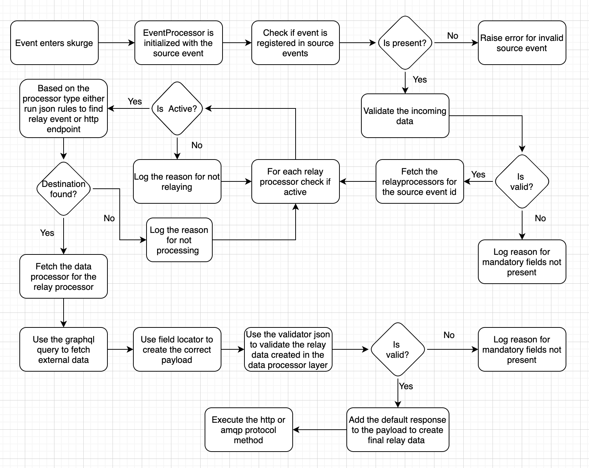
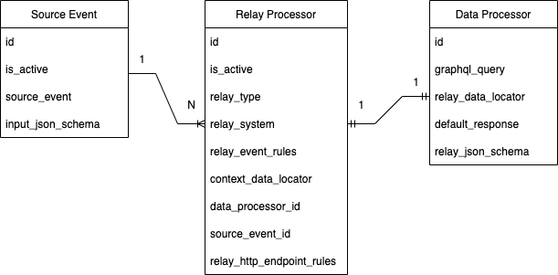

# Skurge #

Skurge is a generic data transformation and data relay service, implementing an if-this-then-that architecture.

Any business software has many underlying services interacting with each other and constantly generating data. 
Transforming this data and relaying it to appropriate system is a common and necessary requirement.
For eg, sending your data to an analytics service for more business insight or sending it to a communication service to send emails to the customer
or establishing asynchronous communication links among your services and much more.
 Handling all these requirements individually in different services may lead to code repetition, difficulty in debugging errors, frequent code changes and overloading core business services with auxiliary work.
 With this, comes a need of a service that can reliably handle all these tasks.

### Solution: Skurge!
Skurge is a ready-to-use, completely configuration driven solution to the above problem.
It receives data, validates it against the schema you define, aggregates more data from your graphql service and relays it to appropriate system by hitting HTTP endpoint or by publishing an event to your messaging queue. It supports conditional logic throughout the flow. 
  Skurge offers following benefits:
* It is completely database configuration driven. No code changes are required for registering a new data processing and relaying flow in skurge. You just need to make entries in skurge's database tables. 
* It can be easily integrated as a microservice in your software.
* It works asynchronously. You can trigger it with necessary input payload and leave the rest for skurge to handle.
* It logs failures in database table which can be used for convenient debugging.  

### Skurge flow
* First, the source event and corresponding data & relay processors needs to be registered in skurge.
* The flow is triggered by hitting the registered source event with necessary payload.
* The source event payload is validated.
* The data processing flow optionally fetches data from a graphql server, validates and transforms data to form the destination payload.
* The relay processor decides the destination which may be an HTTP endpoint or messaging queue and relays the destination payload to the same.
  

### Skurge database tables
| Table            | Column                    | Remarks                                                                                                                                                                                                                                                                                                            |
|:-----------------|:--------------------------|:-------------------------------------------------------------------------------------------------------------------------------------------------------------------------------------------------------------------------------------------------------------------------------------------------------------------|
| source_events    | id                        | Primary key                                                                                                                                                                                                                                                                                                        |
|                  | is_deleted                | True/False for soft deletion                                                                                                                                                                                                                                                                                       |
|                  | is_active                 | True/False to activate or deactivate flow related to this source event.                                                                                                                                                                                                                                            |
|                  | source_event              | Name of the source event. You need to call Skurge's event processing API with this name to trigger the related flow.                                                                                                                                                                                               |
|                  | input_json_schema         | [JsonSchema](https://json-schema.org/) to validate the data received by Skurge.                                                                                                                                                                                                                                    |
| data_processors  | id                        | Primary key                                                                                                                                                                                                                                                                                                        |
|                  | is_deleted                | True/False for soft deletion                                                                                                                                                                                                                                                                                       |
|                  | graphql_query             | Graphql query to fetch more data from your graphql service. The params needed for the queries should be received as input payload by skurge.                                                                                                                                                                       |
|                  | relay_data_locator        | The column uses [JsonLogic](https://jsonlogic.com/) for conditional if-else logic. It uses [GET](https://pydash.readthedocs.io/en/latest/api.html#pydash.objects.get) method of pydash library to get values from data dictionary received from your graphql service and input data dictionary received by skurge. |
|                  | default response          | Default data (Eg. constants) to be relayed can be kept here as a dictionary. The dictionary values support python's [string format method](https://docs.python.org/3/library/stdtypes.html#str.format).                                                                                                            |
|                  | relay_json_schema         | [JsonSchema](https://json-schema.org/) to validate the final payload to be relayed. Final event payload is prepared by relay_data_locator and default_response.                                                                                                                                                    |
| relay_processors | id                        | Primary key                                                                                                                                                                                                                                                                                                        |
|                  | source_event_id           | id of table `source_events`                                                                                                                                                                                                                                                                                        |
|                  | data_processor_id         | id of table `data_processors`                                                                                                                                                                                                                                                                                      |
|                  | is_deleted                | True/False for soft deletion                                                                                                                                                                                                                                                                                       |
|                  | is_active                 | True/False to activate or deactivate the relayer                                                                                                                                                                                                                                                                   |
|                  | relay_type                | This should be `EVENT` if you want to publish event to messaging queue or `API` if you want to hit HTTP endpoint                                                                                                                                                                                                   |
|                  | relay_system              | Here you can add name of system where final payload is relayed                                                                                                                                                                                                                                                     |
|                  | relay_event_rules         | Uses [JsonLogic](https://jsonlogic.com/) library to make relaying decisions when you are publishing `EVENT`. Eg. You may want to relay data to different systems or only if certain conditions are fulfilled.                                                                                                      |
|                  | relay_http_endpoint_rules | Uses [JsonLogic](https://jsonlogic.com/) library to make relaying decisions when you are hitting `HTTP` endpoint. The string values support python's [string format method](https://docs.python.org/3/library/stdtypes.html#str.format).                                                                           |
|                  | context_data_locator      | Uses [GET](https://pydash.readthedocs.io/en/latest/api.html#pydash.objects.get) method of pydash library to form data dictionary to be used for decision making by `relay_event_rules` or `relay_http_endpoint_rules` column.                                                                                      |
| relay_logs       | id                        | Primary key                                                                                                                                                                                                                                                                                                        |
|                  | source_event_name         | Name of source event                                                                                                                                                                                                                                                                                               |
|                  | destination_relay_name    | Name of destination system where data was relayed                                                                                                                                                                                                                                                                  |
|                  | relay_type                | `EVENT` if data was relayed by publishing event to your messaging queue and `API` for HTTP endpoint                                                                                                                                                                                                                |
|                  | relay_data                | Final data relayed                                                                                                                                                                                                                                                                                                 |
|                  | status                    | `SUCCESS` / `FAILURE`                                                                                                                                                                                                                                                                                              |
|                  | reason                    | Error message                                                                                                                                                                                                                                                                                                      |

* The ER diagram for tables `source_events`, `data_processors` and `relay_processors` tables:
  

### APIs
| API                                                                   | Remarks                                                                                                               |
|:----------------------------------------------------------------------|:----------------------------------------------------------------------------------------------------------------------|
| POST `api/v1/register-event`                                          | Registers an event (ie. data processing and relaying) in `source_events` table                                        |
| GET `api/v1/registered-event/<int:event_id>`                          | Gets event corresponding to `event_id` and all its data & relay processors                                            |
| PUT `api/v1/registered-event/<int:event_id>`                          | Updates `source_events` table                                                                                         |
| GET `api/v1/registered-events`                                        | Gets all events registered in skurge                                                                                  |
| POST `api/v1/registered-event/<int:event_id>/relayer`                 | Adds relay and data processor to the registered event ie. adds data in `data_processors` and `relay_processors` table |
| GET `api/v1/registered-event/<int:event_id>/relayer/<int:relayer_id>` | Gets relay and data processor of the registered event                                                                 |
| PUT `api/v1/registered-event/<int:event_id>/relayer/<int:relayer_id>` | Updates relay or corresponding data processor of the registered event                                                 |
| POST `api/v1/relay-event/<slug:event_name>`                           | Processes incoming events and relays it to appropriate system                                                         |

### OpenAPI Specification
OpenAPI specification for above APIs can be found in the resources folder: [OpenAPI Specs](resources/skurge_openapi_specs.yaml).
 You may visualise this yaml file at [editor.swagger.io](https://editor.swagger.io/) 

### Postman collection
* The postman collection for the APIs can be found in the resources folder: [Postman Collection](resources/skurge.postman_collection.json). You can import the json file in postman. 
* The collection uses [sample data](webapp/apps/skurge/tests/common/constants.py) used in integration tests.

### Dependencies
* `Python 3.9`
* The service is written in `Django` & uses `PostrgeSQL` as database.
* [GraphQL](https://graphql.org/), [JsonLogic](https://jsonlogic.com/), [JsonSchema](https://json-schema.org/) and [Pydash](https://pydash.readthedocs.io/en/latest/) libraries.
* Package dependencies are mentioned in [requirements.txt](requirements.txt)

### Installation
* Fork and clone the repository
* Create and activate virtual environment
* Install dependencies in [requirements.txt](requirements.txt) by running `pip install -r requirements.txt`

### Configuration
* Update configurations in [configuration file](webapp/conf/env/conf.py).
* You may also want to review settings in [settings file](webapp/conf/settings.py) and [docker file](Dockerfile).

### Running
* Database migration files are present in [migrations](webapp/apps/skurge/migrations) folder. Run db migration by running `python manage.py migrate`
* The service is a django application and can be run by `python manage.py runserver`. The default port is `7042` which may be updated in [manage.py](manage.py) file.
* You may change [Dockerfile](Dockerfile) to build and deploy docker image.

### Testing
* Integration tests are present in [tests folder](webapp/apps/skurge/tests). You can run the tests by running `python manage.py test`
* Test coverage: > 95%
* The service uses [django-nose](https://pypi.org/project/django-nose/) for testing and code coverage. The configurations for the same are defined in [settings file](webapp/conf/settings.py).
* Sample test data can be found in [constants file](webapp/apps/skurge/tests/common/constants.py). The sample data simulates following scenario:
  * Skurge receives `TEST_EVENT` with `user_id` as input payload.
  * Skurge fetches `name`,`email` and `country code` from the graphql server for the `user_id`.
  * Depending upon country being that of India (`IN`) or not, it prepares two different payloads having user `name` and email `template id`.
  * `from` (eg. your company's email) and `to` (customer email) are also added to final payload as defaults.
  * The final payload is validated against json schema.
  * An event `SEND_EMAIL` is published to messaging queue with final payload prepared above. The payload is meant for system `notification-service`. This may be your notification service which can then send email to the customer.
  * Alternately, one can also hit an API of an `external-service` depending on user's `country code`.

### Getting involved
* You can raise any issues, bugs or feature request via issues tab on GitHub.
* You may fork and create a pull request. The pull request can be merged after review.

### License
* This project is licensed under the terms of Apache license, Version 2.0 ([LICENSE](LICENSE.txt))

### Contact
* [Vinamra Arya](https://github.com/vinamraarya-livspace) (vinamra.arya@livspace.com)
* [Onkar Hoysala](https://github.com/onkarhoysalalivspace) (onkar.hoysala@livspace.com)
* [Ayur Jain](https://github.com/ayurjain-livspace) (ayur.jain@livspace.com)
